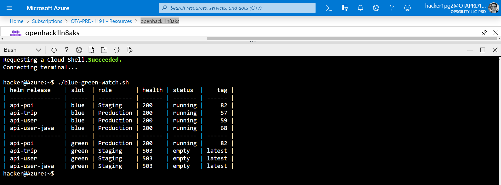

# README

This repo contains my helper utilities for the Microsoft OpenHack in DevOps.

<p></p>

## Installation

```bash
#!/bin/bash
repo="chgeuer/azure_openhack_devops_utils_chgeuer"
script="blue-green-watch.sh"
url="https://raw.githubusercontent.com/${repo}/master/${script}"
curl --silent "${url}" -o "./${script}" && \
    chmod +x "./${script}" && \
    watch -n 1 "./${script}"
```

## Fixing a run of `helm update` without the `--reuse-values` parameter

```bash
#!/bin/bash
repo="chgeuer/azure_openhack_devops_utils_chgeuer"
script="fix-reuse-values.sh"
url="https://raw.githubusercontent.com/${repo}/master/${script}"
curl --silent "${url}" -o "./${script}" && \
    chmod +x "./${script}" && \
    "./${script}"
```
